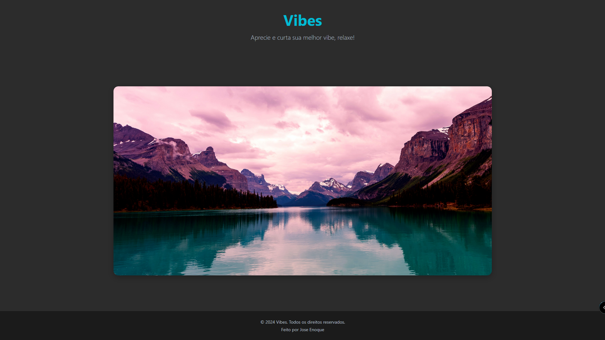

# Vibes 🌿

**Aprecie e curta sua melhor vibe, relaxe!**

Vibes é uma aplicação web projetada para oferecer uma experiência visual e sensorial única, com paisagens naturais deslumbrantes que proporcionam um ambiente de relaxamento e bem-estar. Esta galeria interativa apresenta um slideshow de imagens de alta qualidade, combinadas com um design moderno e uma paleta de cores serena.

## 📸 Capturas de Tela

|  |  |  |  |
|----------------------------------------|----------------------------------------|----------------------------------------|----------------------------------------|

## 🚀 Tecnologias Utilizadas

- **HTML5**: Estrutura semântica para o conteúdo da aplicação.
- **CSS3**: Estilização avançada com animações e design responsivo.
- **JavaScript (Opcional)**: Pode ser integrado para futuras funcionalidades interativas.

## 🎨 Design

- **Tipografia**: `Segoe UI` com um toque moderno e clean.
- **Cores**: 
  - Fundo escuro (#2c2c2c) para criar um ambiente elegante.
  - Tons de azul e cinza para uma experiência visual agradável.
- **Layout Responsivo**: Adaptável para diferentes tamanhos de tela, garantindo uma visualização otimizada em dispositivos móveis e desktops.

## 📂 Estrutura do Projeto

```arduino

Vibes/
│
├── public/
│   ├── image/
│   │   ├── nature1.png
│   │   ├── nature2.png
│   │   ├── nature3.png
│   │   └── nature4.png
│   └── styles/
│       └── styles.css
│
├── index.html
└── vercel.json

```
- **public/image**: Contém as imagens usadas no slideshow.
- **public/styles**: Contém o arquivo CSS para a estilização.
- **index.html**: Arquivo principal da aplicação.
- **vercel.json**: Configuração de roteamento para deploy na **[Vercel](https://vercel.com/)**.

## 📦 Deploy

A aplicação está hospedada na **[Vercel](https://vercel.com/)**, garantindo um desempenho otimizado e fácil acesso.

### Passos para Deploy

1. Crie uma conta na **[Vercel](https://vercel.com/signup)**

2. Conect seu repositório **[GitHub](https://github.com/login)**

3. Configure o projeto com as opções padrão.

4. O deploy será automaticamente gerado após cada commit.

## 📚 Como Usar

1. **Clone o Repositório:**

```bash

git clone https://github.com/SeuUsuario/Vibes.git

```

2. **Navegue até o Diretório:**

```bash

cd Vibes

```

3. **Abra o arquivo `index.html` no navegador:**

```bash

open index.html

```

4. **Experimente a aplicação em modo local.**

## 🔮 Funcionalidades Futuras

- **Áudio Relaxante**: Integração de trilhas sonoras para uma experiência ainda mais imersiva.

- **Modo Tema**: Opção para alterar entre temas claro e escuro.

- **Opções de Navegação**: Controles de navegação para o slideshow.

## 🖋️ Autor

### Desenvolvido por **José Enoque**.

#

### 📄 Licença

Este projeto está sob a licença MIT - veja o arquivo **[LICENSE](/LICENCE)** para mais detalhes.

### 🌐 Acesse o Site

Visite a aplicação em: **[Vibes](https://vibes-lemon.vercel.app/)**

#

### 🖼️ Projeto

<p align="center">  </p>