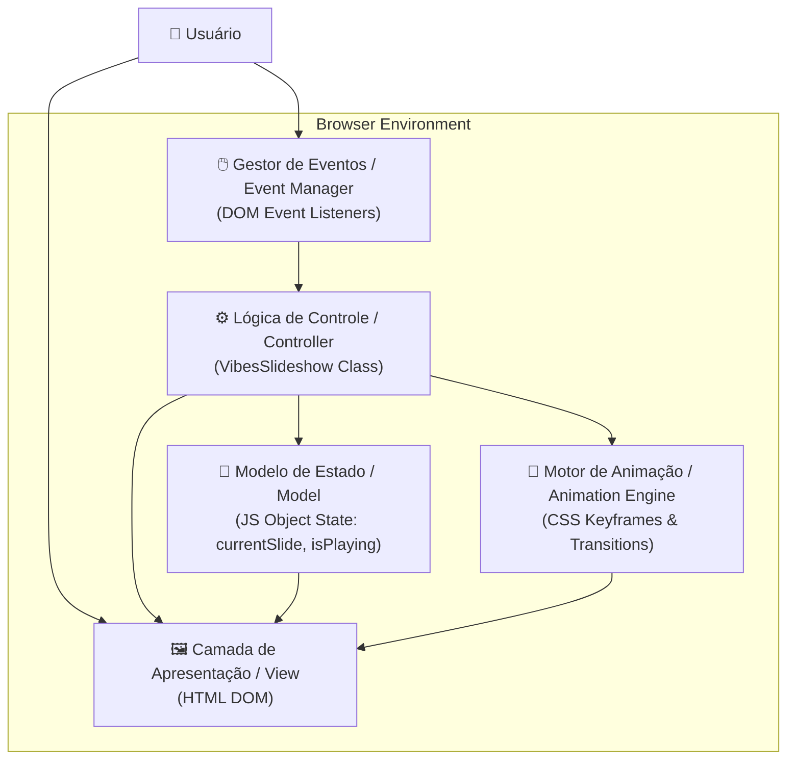

# Vibes: Uma Análise Arquitetural de Experiências Web Imersivas

**Uma Imersão Sinestésica em Paisagens Digitais para o Bem-Estar Contemplativo.**

<p align="center">
  <a href="https://vibes-lemon.vercel.app" target="_blank" rel="noopener noreferrer">
    
  </a>
</p>

---

## Abstract (Resumo Técnico)

Este documento delineia a arquitetura e a implementação do projeto "Vibes", uma aplicação web de página única (SPA) concebida como um santuário digital para relaxamento e contemplação. O projeto aborda o crescente problema da fadiga digital, propondo uma solução que se afasta dos paradigmas de interação de alta densidade informativa.

Em seu núcleo, "Vibes" oferece uma galeria interativa de paisagens naturais, orquestrada para induzir um estado de calma e bem-estar. A metodologia empregada se baseia em uma arquitetura puramente client-side, utilizando Vanilla JavaScript (ES6+) para lógica de controle e gerenciamento de estado, e animações CSS3 avançadas para criação de uma atmosfera visualmente rica e procedural.

A principal inovação reside na orquestração de múltiplas tecnologias web nativas — como `IntersectionObserver` para otimização de performance, animações de keyframes aceleradas por GPU e design responsivo com efeitos de glassmorphism — para construir uma experiência performática, esteticamente sofisticada e emocionalmente ressonante, sem sobrecarga de frameworks externos.

## Badges

[](https://github.com/ESousa97/Vibes/actions/workflows/ci.yml)
[](https://github.com/ESousa97/Vibes/actions/workflows/codeql.yml)
[](https://eslint.org/)
[](https://github.com/ESousa97/Vibes/actions)
[](LICENSE)
[](https://vibes-lemon.vercel.app)

## Sumário (Table of Contents)

1. [Introdução e Motivação](#introdução-e-motivação)
3. [Arquitetura do Sistema](#arquitetura-do-sistema)
4. [Decisões de Design Chave](#decisões-de-design-chave)
5. [✨ Funcionalidades Detalhadas (com Casos de Uso)](#-funcionalidades-detalhadas-com-casos-de-uso)
6. [🛠️ Tech Stack Detalhado](#️-tech-stack-detalhado)
7. [📂 Estrutura Detalhada do Código-Fonte](#-estrutura-detalhada-do-código-fonte)
8. [📋 Pré-requisitos Avançados](#-pré-requisitos-avançados)
9. [🚀 Guia de Instalação e Configuração](#-guia-de-instalação-e-configuração)
10. [⚙️ Uso Avançado e Exemplos](#️-uso-avançado-e-exemplos)
11. [🧪 Estratégia de Testes e Qualidade de Código](#-estratégia-de-testes-e-qualidade-de-código)
12. [🚢 Deployment Detalhado e Escalabilidade](#-deployment-detalhado-e-escalabilidade)
13. [❓ FAQ (Perguntas Frequentes)](#-faq-perguntas-frequentes)
14. [📜 Licença e Aspectos Legais](#-licença-e-aspectos-legais)
15. [📞 Contato](#-contato)

## Introdução e Motivação

No cenário digital contemporâneo, caracterizado pela sobrecarga de informações (*infobesity*) e pela constante demanda por atenção, emerge uma necessidade crítica por espaços digitais que promovam a tranquilidade e a introspecção. O projeto "Vibes" nasce como uma antítese a essa tendência, propondo um ambiente web minimalista e imersivo, projetado para funcionar como um refúgio digital.

A motivação central é investigar a interseção entre design de interface, tecnologia front-end e bem-estar psicológico, explorando como a manipulação cuidadosa de elementos visuais e interativos pode influenciar positivamente o estado emocional do usuário. A proposta de valor única reside em sua abordagem purista e performática, evitando deliberadamente frameworks JavaScript pesados para demonstrar a potência das tecnologias web fundamentais.

## Arquitetura do Sistema

A arquitetura do "Vibes" é inteiramente client-side, otimizada para performance e simplicidade de implantação. A estrutura segue um padrão adaptado do Model-View-Controller (MVC) para o contexto de uma SPA baseada em Vanilla JS.



**Componentes Arquiteturais:**

**Camada de Apresentação (View):** Composta pelo `index.html`, define estrutura semântica do DOM. Camada passiva que serve como receptáculo para conteúdo dinâmico e efeitos visuais.

**Motor de Animação (Animation Engine):** Implementado exclusivamente com CSS3, utiliza `keyframes`, `transitions` e `transforms` para renderizar animações de fundo (orbes e partículas) e transições do slideshow.

**Lógica de Controle (Controller):** Cérebro da aplicação, encapsulado na classe `VibesSlideshow`. Responsável por lógica de negócio: gerenciar ciclo de vida do slideshow, responder a eventos e controlar reprodução das animações.

**Modelo de Estado (Model):** Representado pelas propriedades internas da classe `VibesSlideshow` (`currentSlide`, `isPlaying`, `slideInterval`). Estado simples e localizado que dita comportamento da aplicação.

**Gestor de Eventos (Event Manager):** Coleção de event listeners configurados pela classe `VibesSlideshow`, traduzindo ações do usuário em chamadas de método.

## Decisões de Design Chave

1. **JavaScript "Vanilla" (ES6+) como Pilar Lógico:** Decisão estratégica para criar base de código performática com zero dependências externas, demonstrando capacidade da linguagem nativa para gerenciar estados complexos através de OOP.

2. **CSS como Motor de Animação Principal:** Abordagem declarativa com CSS em vez de manipulação via JavaScript. Animações procedurais definidas por `keyframes` liberam main thread e permitem otimização na GPU.

3. **Otimização Proativa com `IntersectionObserver`:** Implementação para pausar slideshow quando fora do viewport, conservando recursos CPU e bateria para melhor experiência do usuário.

4. **CSS Modular para Manutenibilidade:** Estilos consolidados em `Styles/styles.css`, mantendo separação clara entre estrutura e apresentação.

5. **Design Glassmorphism:** Efeitos visuais modernos com backdrop-filter e transparências para criar atmosfera imersiva e contemporânea.

## ✨ Funcionalidades Detalhadas (com Casos de Uso)

### 1. Slideshow Imersivo e Automatizado

**Propósito:** Núcleo da aplicação com transições suaves entre paisagens de alta qualidade, incluindo barra de progresso visual.

**Caso de Uso:** Usuário abre aplicação e a deixa em segundo plano em monitor para criar ambiente de trabalho calmo, observando paisagens mudarem passivamente.

### 2. Controle Multimodal de Navegação

**Propósito:** Controle total através de botões na interface, atalhos de teclado e gestos de toque.

**Caso de Uso:** Usuário encontra imagem que lhe agrada, pressiona barra de espaço para pausar slideshow, depois usa setas do teclado para explorar outras imagens em próprio ritmo.

### 3. Atmosfera Visual Dinâmica e Procedural

**Propósito:** Interface enriquecida com animações de fundo sutis: orbes coloridas flutuantes e partículas brilhantes, geradas proceduralmente via CSS.

**Caso de Uso:** Usuário foca atenção no ambiente como um todo, percebendo movimento suave das luzes que contribui para efeito hipnótico e relaxante.

### 4. Gerenciamento Inteligente de Recursos

**Propósito:** Aplicação monitora estado de visibilidade, pausando animações quando usuário muda de aba ou minimiza janela.

**Caso de Uso:** Usuário deixa "Vibes" aberto em aba enquanto trabalha em outra. Aplicação não consome recursos desnecessários, retomando experiência transparentemente ao retornar.

## 🛠️ Tech Stack Detalhado

| Categoria | Tecnologia | Versão | Propósito no Projeto | Justificativa da Escolha |
| :--- | :--- | :--- | :--- | :--- |
| **Frontend (Linguagem)** | **HTML5** | N/A | Estruturação semântica do conteúdo | Padrão fundamental da web para marcação |
| **Frontend (Estilo)** | **CSS3** | N/A | Estilização, layout, glassmorphism e motor de animação | Animações performáticas aceleradas por GPU de forma declarativa |
| **Frontend (Lógica)** | **JavaScript** | ES6+ | Lógica de controle, gerenciamento de estado e interatividade | Performance nativa, zero dependências, controle granular |
| **Frontend (API Web)** | **IntersectionObserver** | N/A | Pausar/retomar slideshow baseado em visibilidade | Abordagem moderna para otimização de performance |
| **Frontend (API Web)** | **DOM API** | N/A | Manipulação direta da estrutura da página | Interface nativa do navegador para interação com conteúdo |
| **Design (Tipografia)** | **Google Fonts (Inter)** | N/A | Fonte principal da interface | Fonte variável legível em diversas resoluções |
| **DevOps (Plataforma)** | **Vercel** | N/A | Hospedagem, deploy contínuo e CDN global | Integração GitHub, zero configuração para projetos estáticos |
| **DevOps (Controle)** | **Git & GitHub** | N/A | Versionamento e gerenciamento do projeto | Padrão da indústria para desenvolvimento e controle de versão |

## 📂 Estrutura Detalhada do Código-Fonte

```
Vibes/
├── .github/               # Workflows e templates
├── Assets/                # Imagens do slideshow
├── Styles/                # Estilos CSS
├── scripts/               # JavaScript da aplicação
├── docs/                  # Documentação adicional
├── public
├── src/                   # Reservado para modularização futura
├── tests/                 # Testes automatizados
├── tools/                 # Scripts de verificação
├── index.html             # Ponto de entrada
├── LICENSE                # Licença MIT
├── package.json           # Scripts e ferramentas
├── vercel.json            # Configuração para deploy Vercel
└── README.md              # Documentação
```

**Detalhamento dos Arquivos:**

- `index.html`: Estrutura HTML e referências para CSS/JS externos
- `Styles/`: Folha de estilos principal
- `scripts/`: Lógica do slideshow
- `tests/`: Base mínima de testes com Vitest + JSDOM
- `vercel.json`: Configuração de rewrites para comportamento de SPA

## 📋 Pré-requisitos Avançados

Para desenvolvimento e execução local:

**Para Usuários:**
- **Navegador Web Moderno:** Chrome v80+, Firefox v78+, Safari v14+, Edge v80+ (suporte completo a HTML5, CSS3, ES6+)

**Para Desenvolvimento:**
- **Git:** Sistema de controle de versão
- **Editor de Código:** VS Code, Sublime Text, WebStorm
- **Servidor Web Local (Opcional):** Live Server extension para VS Code para emulação fiel do ambiente de produção

## 🚀 Guia de Instalação e Configuração

1. **Clonar o Repositório:**
```bash
git clone https://github.com/ESousa97/Vibes.git
cd Vibes
```

2. **Rodar localmente:**
```bash
# Abra index.html diretamente no navegador
# ou use um servidor local (ex: Live Server)
```

3. **Ferramentas de qualidade (opcional):**
```bash
npm install
npm run lint
npm run test
```

### Scripts de Desenvolvimento
```bash
# Lint completo
npm run lint

# Testes com cobertura
npm run test

# Verificação de build estático
npm run build
```

## ⚙️ Uso Avançado e Exemplos

**Atalhos de Teclado:**

- **`Barra de Espaço`:** Alterna entre Play e Pause no slideshow
- **`Seta Esquerda (←)`:** Navega para slide anterior
- **`Seta Direita (→)`:** Navega para próximo slide
- **`Home`:** Salta para primeiro slide da galeria
- **`End`:** Salta para último slide da galeria

**Customização de Imagens:**

Para adicionar ou alterar imagens do slideshow:

```html
<!-- Edite as seções no index.html -->
<div class="slide">
    
</div>
```

**Depuração via Console:**

```javascript
// Verificar estado atual do slideshow
console.log(vibesSlideshow.currentSlide);
console.log(vibesSlideshow.isPlaying);

// Controlar programaticamente
vibesSlideshow.nextSlide();
vibesSlideshow.togglePlayPause();
```

## 🧪 Estratégia de Testes e Qualidade de Código

**Qualidade Atual:**
- Lint HTML/CSS/JS com `html-validate`, `stylelint` e `eslint`.
- Testes básicos com Vitest + JSDOM.

**Testes Implementados:**
- Validação de quantidade de slides e indicadores.
- Verificação de avanço de slide ao chamar `nextSlide()`.

## 🚢 Deployment Detalhado e Escalabilidade

**Plataforma:** Implantado na **Vercel** com otimização para aplicações front-end.

**Processo de Deploy:**
- Deploy contínuo automatizado via GitHub
- Detecção automática de projeto estático
- Zero configuração necessária

**Configuração (`vercel.json`):**
```json
{
    "rewrites": [
        { "source": "/(.*)", "destination": "/index.html" }
    ]
}
```

**Escalabilidade:**
- **Inerentemente alta:** Site estático servido por CDN global
- **Baixa latência:** Ativos distribuídos geograficamente
- **Performance:** Cache de navegador otimiza carregamentos subsequentes
- **Recursos mínimos:** Sem dependência de servidor backend

**Otimizações de Produção:**
```bash
# Minificação de CSS
npx clean-css-cli --output styles.min.css Styles/styles.css

# Compressão de imagens
npx imagemin Assets/*.png --out-dir=optimized/

# Análise de performance
npx lighthouse https://vibes-lemon.vercel.app
```

## ❓ FAQ (Perguntas Frequentes)

**P: Por que o CSS está dentro do HTML e não em arquivo separado?**
**R:** Decisão pragmática para otimizar carregamento inicial eliminando requisição de rede adicional. Para projetos maiores, separação de arquivos é melhor prática.

**P: Por que usar JavaScript "puro" em vez de frameworks como React ou Vue?**
**R:** Escolha deliberada para manter aplicação extremamente leve, performática e com zero dependências, demonstrando capacidade das ferramentas nativas do navegador.

**P: Como adicionar minhas próprias imagens ao slideshow?**
**R:** Edite diretamente o `index.html`. Localize seções `<div class="slide">` e altere atributo `src` das tags ``. Adicione novas imagens ao diretório `Assets/`.

**P: A aplicação funciona offline?**
**R:** Sim, após primeiro carregamento. Todas as imagens e scripts são carregados inicialmente, permitindo uso sem conexão à internet.

**P: É possível adicionar áudio de relaxamento?**
**R:** Atualmente não implementado, mas está no roadmap futuro utilizando Web Audio API para trilhas sonoras com looping perfeito.

**P: O projeto é responsivo?**
**R:** Sim, totalmente responsivo com design adaptativo para desktop, tablet e mobile, mantendo qualidade visual em todas as resoluções.

## 📜 Licença e Aspectos Legais

Este projeto é distribuído sob a **Licença MIT**, uma licença permissiva que permite reutilização, modificação e distribuição do código (inclusive para fins comerciais), desde que o aviso de direitos autorais seja mantido. Para detalhes completos, consulte o arquivo [LICENSE](LICENSE).

## 📞 Contato

- **GitHub:** [@ESousa97](https://github.com/ESousa97)
- **LinkedIn:** [Enoque Sousa](https://www.linkedin.com/in/enoque-sousa-bb89aa168/)
- **Demo Online:** [vibes-lemon.vercel.app](https://vibes-lemon.vercel.app)
- **Issues:** Para bugs e sugestões, use [GitHub Issues](https://github.com/ESousa97/Vibes/issues)

---

<p align="center">
  
  
</p>

<p align="center">
  <em>Desenvolvido com ❤️ por José Enoque - Criando santuários digitais para o bem-estar contemplativo</em>
</p>


> ✨ **Criado em:** 9 de nov. de 2024 às 01:13
